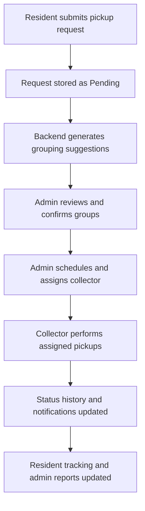
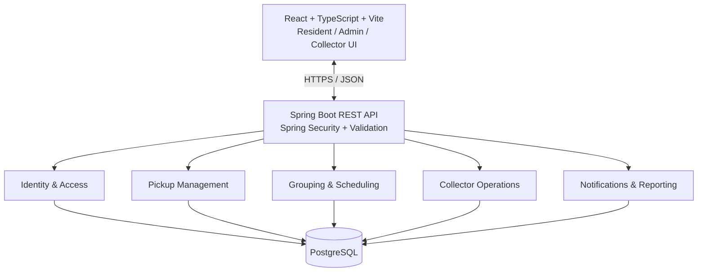
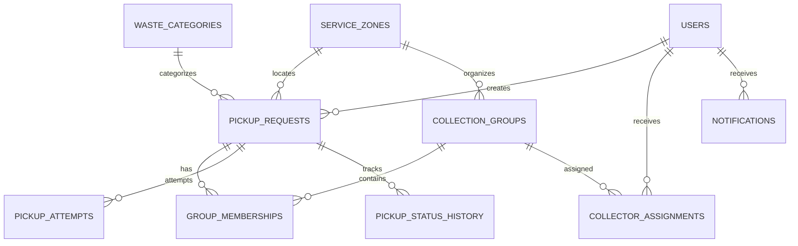

# WasteCollect — Full-Stack Software Development Plan

**Project:** WasteCollect  
**Document type:** Technical Development Plan / Implementation Roadmap  
**Version:** 1.0  
**Date:** 9 October 2026  
**Development approach:** Greenfield (built entirely from scratch)  
**Status:** Proposed architecture and delivery plan — subject to detailed M0 review  
**Primary reference:** `WasteCollect_SRS.md` (SRS v1.0)

> **Project direction:** Build a complete, production-oriented web waste collection management platform. No Lovable-generated code, architecture, components, or database will be reused. All core capabilities and originally proposed advanced features remain in the roadmap, implemented in dependency order.

---

## 1. Executive Summary

WasteCollect connects **residents**, **administrators**, and **waste collectors** through a single web platform. Residents request pickups and track their progress; administrators group nearby requests by service zone and date, schedule work, and assign collectors; collectors carry out assigned pickups and report outcomes.

The system's central operational capability is **turning individual pickup requests into manageable collection groups**. The first grouping algorithm will be deterministic, based on predefined service zones and requested dates. The architecture will allow later extensions for GPS proximity, fleet capacity, and route optimization.

**Architectural recommendation:** A React/TypeScript frontend, a modular Spring Boot backend exposing REST APIs, and PostgreSQL as the system of record. Build the application using vertical slices, backed by automated testing, migrations, documented business rules, and a staged release process.

### Key outcomes

- A full user experience for residents, admins, and collectors.
- Secure authentication, authorization, and data ownership.
- Persisted requests, grouping, scheduling, assignments, status history, and notifications.
- Administrator dashboards, search/filtering, analytics, and reports.
- A reliable foundation for advanced logistics, AI, billing, and integrations.

## 2. Product Scope and User Roles

### 2.1 Core functional scope

| Area | Included capabilities |
|---|---|
| Public experience | Landing page, How It Works, waste category information, registration/login |
| Residents | Dashboard, request form, waste type/quantity, address/zone/date, optional notes, confirmation ID, tracking, cancellation, history |
| Administrators | Request listing/search/filtering, dashboard metrics, grouping suggestions, group management, scheduling, collector management and assignment |
| Collectors | Dashboard, assigned groups, pickup details, today's work, start work, mark completed/failed, task history |
| Platform services | Role-based access, status lifecycle validation, in-app notifications, collection history, reports, audit events |

### 2.2 Advanced scope retained in roadmap

The following capabilities are **not dropped**, but require the core platform and sometimes external services: GPS clustering, vehicle/route optimization, live vehicle tracking, AI-assisted waste photo classification, smart scheduling, sustainability analytics, online payments and pricing, smart-bin IoT integration, and government-system integration.

### 2.3 Roles and responsibilities

1. **Resident:** Register, create requests, view only their own request data, track scheduled collections, cancel eligible requests, view history.
2. **Administrator:** Manage supported areas/categories, inspect all requests, confirm or revise grouping, schedule groups, assign/reassign collectors, view metrics and audit activity.
3. **Collector:** View only assigned groups and pickup addresses; start assigned work and record pickup success or failure.

### 2.4 High-level operational flow



## 3. Engineering Principles and Architecture

### 3.1 Architecture decision: modular monolith

Use **one Spring Boot application** with logically independent business modules, rather than microservices. The modules share transactions and a single PostgreSQL instance but communicate through explicit service boundaries.

**Rationale:** simpler operations, consistent transactional grouping, lower infrastructure complexity, straightforward testing, and future ability to extract selected services where justified.



### 3.2 Technology stack

| Layer | Technology | Reason |
|---|---|---|
| Frontend | React, TypeScript, Vite | Strong tooling, type safety, fast iteration |
| Styling / components | Tailwind CSS, shadcn/ui | Consistent, responsive dashboard UI |
| Frontend routing | React Router | Client-side pages and role navigation |
| API and server state | TanStack Query | Fetching, invalidation, loading/error state |
| Forms | React Hook Form, Zod | Client-side input management and validation |
| Backend | Java, Spring Boot | Business services, security, APIs |
| Authorization | Spring Security | Backend-enforced authentication and RBAC |
| Sessions | Short-lived JWT access tokens and controlled refresh sessions | Secure browser/API sessions |
| Persistence | PostgreSQL, Spring Data JPA/Hibernate | Relational transactions and constraints |
| Schema changes | Flyway | Versioned database migrations |
| API contracts | OpenAPI / Swagger UI | Shared contract between backend and frontend |
| Backend tests | JUnit, Mockito, Testcontainers | Unit and real-PostgreSQL integration tests |
| Frontend tests | Vitest, React Testing Library | Components and user interactions |
| End-to-end tests | Playwright | Complete role-based user journeys |
| Local infrastructure | Docker Compose | Repeatable development dependencies |
| CI/CD | GitHub Actions | Build, lint, test, release checks |
| Deployment | Managed frontend hosting, Spring Boot hosting, managed PostgreSQL | Independent lifecycle and operational control |

**Optional later:** PostGIS for geographic queries, object storage for uploaded images, a jobs/outbox mechanism for reliable asynchronous notifications, and a payment/location/map provider when those features are introduced.

### 3.3 Backend module boundaries

| Module | Owns |
|---|---|
| `auth` / `users` | Accounts, identities, roles, sessions, profiles |
| `servicearea` | Cities/zones and service coverage |
| `wastecategory` | Waste catalog and measurement rules |
| `pickup` | Requests, cancellation, request status history |
| `grouping` | Eligibility, suggestions, membership confirmation |
| `scheduling` | Scheduled collection dates, rescheduling, group lifecycle |
| `collector` | Collector records, assignment and pickup operations |
| `notification` | Notifications, templates, delivery status |
| `reporting` | Administrative metrics, history, reporting queries |
| `integration` | AI, geospatial, IoT, payment, and external adapters |
| `common` | Shared error handling, configuration, cross-cutting security, audit support |

**Boundary rule:** Business logic belongs in services/domain components, not controllers. Persisted invariants must also be protected by constraints and transactions.

## 4. Database Design Plan

The initial SRS listed `users`, `pickup_requests`, `collection_groups`, and `notifications`. A complete application needs additional normalized entities and historical records.

### 4.1 Proposed core entities

| Table | Purpose / notable fields |
|---|---|
| `users` | UUID ID, unique email, password hash, role, account status, timestamps |
| `service_zones` | UUID ID, city, canonical zone name, service availability |
| `waste_categories` | Category code/name and permitted quantity units |
| `pickup_requests` | UUID ID, public request code, resident ID, category, numeric quantity/unit, address, zone ID, preferred date, optional coordinates/notes, status |
| `collection_groups` | UUID ID, zone ID, planned collection date, group status, timestamps |
| `group_memberships` | Request ID, group ID, added/removed timestamps; at most one active membership per request |
| `collector_assignments` | Group ID, collector ID, assigned/unassigned timestamps, assignment state |
| `pickup_attempts` | Request ID, collector ID, attempt time, result, optional reason/notes |
| `pickup_status_history` | Request ID, previous/new status, actor, timestamp, reason |
| `notifications` | Recipient ID, event type, message, read time, delivery state |
| `audit_logs` | Actor, action, entity, timestamp, relevant non-sensitive context |
| `refresh_sessions` | User ID, hashed/rotated refresh-token reference, expiry, revocation metadata |

### 4.2 Relationship sketch



### 4.3 Critical schema decisions

- Use **UUIDs** as internal primary keys and separate human-readable identifiers such as `WC-2026-000123` for customers.
- Store **`service_zone_id`** as a foreign key; do not group by free-text neighborhood names.
- Store **quantity as a number plus unit**, not an arbitrary string.
- Keep preferred pickup date distinct from **confirmed scheduled collection date**.
- Preserve group membership, assignment, pickup attempt, and status-change histories.
- Enforce foreign keys, unique emails/public request codes, input constraints, and indexes for zone/date/status filtering.
- Guarantee at most one active group membership for a request. Use an appropriate database constraint/index in addition to application checks.
- Use transactions and concurrency controls when confirming groups and assignments.
- Add all schema changes through **Flyway migrations**; do not silently mutate production schemas.

### 4.4 Planned advanced tables

Introduce vehicle/route/route-stop, location-update, waste-photo/classification, payment/invoice/refund, smart-bin/device-event, and external-sync entities **when their modules are designed**, rather than prematurely modeling their entire schemas now.

## 5. Core Business Rules to Finalize in M0

The SRS specifies the primary behaviors but does not fully resolve all edge cases. The following items require explicit decisions and acceptance tests:

| Topic | Design question / proposed direction |
|---|---|
| Service coverage | Which cities/zones are supported, and how are zones created/retired? Use controlled zone IDs. |
| Group eligibility | Initially only eligible, unassigned requests with compatible zone/date; revalidate on confirmation. |
| Group capacity | Decide whether quantity or number-of-stops limits apply from day one; design an extension point. |
| Suggestions vs confirmed groups | Suggestions are previews; only confirmation creates committed memberships. |
| Concurrency | Two admins cannot confirm the same request into different active groups. |
| Cancellation | Residents can cancel only according to status and operational cutoff; define explicit scheduled-state policy. |
| Rescheduling | Decide who may change dates and how a moved request affects group membership. |
| Collector availability | Define how overlapping assignments are validated and resolved. |
| Failure & retry | Define reasons, retry rules, and whether to create a new pickup attempt or request. |
| Group completion | Define completion when some requests succeed but others fail. |
| Notification reliability | Decide which events must generate persistent in-app notifications and retry on delivery failure. |
| Reporting | Define exactly which statuses, dates, and units contribute to each metric. |

### 5.1 Grouping algorithm (initial version)

1. Fetch pickup requests eligible for grouping.
2. Normalize eligibility using linked service-zone IDs and requested collection dates.
3. Partition candidates by **`(service_zone_id, preferred_date)`**.
4. Return draft grouping suggestions without modifying persistent group membership.
5. Allow administrator review, manual adjustment, and confirmation.
6. On confirmation, within a transaction: re-check eligibility, prevent conflicting membership, create group records/memberships, record audit events, and update request statuses.

The grouping algorithm should live in a dedicated backend service so later GPS/capacity/route algorithms can replace the partition strategy without changing authentication or resident workflows.

### 5.2 Status models

**Pickup request statuses:** `PENDING` → `GROUPED` → `SCHEDULED` → `IN_PROGRESS` → `COMPLETED` or `FAILED`. `CANCELLED` is allowed from specifically authorized pre-collection states.

**Collection group statuses:** `DRAFT` → `SCHEDULED` → `IN_PROGRESS` → `COMPLETED`, with a controlled `CANCELLED` path.

These are **high-level models, not yet complete transition matrices**. Failed pickup recovery, cancellation cutoffs, reassignment, and exceptional transitions must be decided in M0. All transitions will be validated in the backend and recorded in history.

### 5.3 Authorization matrix

| Operation | Resident | Administrator | Collector |
|---|---|---|---|
| Submit request | Own account | No by default | No |
| Read pickup request | Own | All permitted | Assigned only |
| Cancel request | Own eligible | Authorized override | No |
| Generate/confirm groups | No | Yes | No |
| Schedule/reassign group | No | Yes | No |
| Start/completion/failure updates | No | Authorized override | Assigned only |
| Read system-wide reports | No | Yes | No |

Residents can self-register; administrators are provisioned securely; administrators create or invite collector accounts. Enforce permissions at **both role and record ownership** levels.

## 6. REST API Contract Plan

Publish an OpenAPI document with typed request/response DTOs, pagination, filters, errors, authorization requirements, and examples. Prefix endpoints with **`/api/v1`**.

| Module | Proposed endpoints |
|---|---|
| Auth | `POST /auth/register`, `POST /auth/login`, `POST /auth/refresh`, `POST /auth/logout` |
| Users | `GET /users/me`, `PATCH /users/me` |
| Service areas | `GET /zones`, `POST /admin/zones` |
| Waste categories | `GET /waste-categories` |
| Resident pickups | `POST /requests`, `GET /requests/my`, `GET /requests/{id}`, `PATCH /requests/{id}/cancel` |
| Admin pickups | `GET /admin/requests`, `GET /admin/requests/{id}` |
| Grouping | `POST /admin/groups/suggestions`, `POST /admin/groups` |
| Group operations | `GET /admin/groups`, `PATCH /admin/groups/{id}`, `PATCH /admin/groups/{id}/schedule` |
| Collector administration | `GET /admin/collectors`, `POST /admin/collectors`, `PATCH /admin/groups/{id}/assign` |
| Collector work | `GET /collector/groups`, `PATCH /collector/requests/{id}/status` |
| Notifications | `GET /notifications`, `PATCH /notifications/{id}/read` |
| Reporting | `GET /admin/dashboard/stats`, `GET /admin/reports/collections` |

**API conventions:** ISO-8601 timestamps with timezone, stable JSON field names, consistent pagination/sorting, meaningful HTTP status codes, validation error details, and idempotency safeguards for important state-changing actions where needed.

## 7. Frontend Application Plan

Create a new React + TypeScript + Vite application. Separate role-specific pages from reusable components and the API/data access layer.

### 7.1 Pages and flows

- **Public:** Home, How It Works, waste information, Register, Login.
- **Resident:** Overview, Create Pickup, My Requests, Request Detail/Tracking, Profile, Notifications.
- **Administrator:** Overview, All Requests, Group Suggestions/Management, Scheduling, Collectors, Reports, Settings.
- **Collector:** Overview, Assigned Groups, Daily Tasks, Pickup Detail, Completed Work, Profile.

### 7.2 Frontend standards

- Shared design system for typography, colors, cards, inputs, tables, status indicators, and empty/loading/error states.
- Feature-first folders, typed API clients, centralized auth/session handling, and TanStack Query for server-backed state.
- Accessible forms and responsive mobile/tablet/desktop experiences.
- Route guards improve UX, but **the backend remains the security authority**.
- Avoid embedding grouping decisions or permission rules exclusively in frontend components.

## 8. Repository and Project Organization

Use a **monorepo** with separate frontend and backend packages.

```text
WasteCollect/
├── frontend/
│   ├── src/
│   │   ├── app/
│   │   ├── components/
│   │   ├── features/
│   │   │   ├── auth/
│   │   │   ├── resident/
│   │   │   ├── admin/
│   │   │   └── collector/
│   │   ├── hooks/
│   │   ├── services/
│   │   ├── types/
│   │   └── utils/
│   ├── package.json
│   └── vite.config.ts
├── backend/
│   ├── src/
│   │   ├── main/
│   │   │   ├── java/com/wastecollect/
│   │   │   │   ├── auth/
│   │   │   │   ├── users/
│   │   │   │   ├── servicearea/
│   │   │   │   ├── wastecategory/
│   │   │   │   ├── pickup/
│   │   │   │   ├── grouping/
│   │   │   │   ├── scheduling/
│   │   │   │   ├── collector/
│   │   │   │   ├── notification/
│   │   │   │   ├── reporting/
│   │   │   │   ├── integration/
│   │   │   │   └── common/
│   │   │   └── resources/db/migration/
│   │   └── test/
│   └── pom.xml
├── docs/
│   ├── requirements/
│   ├── architecture/
│   ├── database/
│   ├── api/
│   ├── testing/
│   └── roadmap/
├── infrastructure/
│   └── docker-compose.yml
├── .github/workflows/
└── README.md
```

## 9. Delivery Strategy: Vertical Slices

Do not implement the entire backend and frontend as disconnected efforts. For each feature:

1. Confirm requirements, business rules, and acceptance criteria.
2. Implement database entities, constraints, and Flyway migration.
3. Implement service logic, authorization, and REST contract.
4. Write unit and real-database integration tests.
5. Build the matching frontend page/components and integrate the API.
6. Run end-to-end user-flow tests and update documentation.

**Example:** A pickup request feature is not finished until a resident can submit through React, the Spring Boot API validates and persists the request, the user can retrieve it after a refresh, access control works, and automated tests pass.

## 10. Milestone-Based Implementation Roadmap

Each milestone has a deliverable and an explicit exit gate. Later milestones remain part of the full scope, not discarded features.

### M0 — Requirements Finalization and System Design

**Work:** Review the SRS; settle grouping, scheduling, cancellation, retry, and assignment rules; design module boundaries; ERD; security model; OpenAPI contracts; status transition matrices; and the implementation backlog.

**Deliverables:** `SYSTEM_ARCHITECTURE.md`, `DATABASE_DESIGN.md`, `DOMAIN_MODEL.md`, `API_CONTRACTS.md`, `BUSINESS_RULES.md`, `SECURITY_DESIGN.md`, `IMPLEMENTATION_ROADMAP.md`, and `TEST_PLAN.md`.

**Exit gate:** No unresolved decisions blocking the initial data model, authentication, or core pickup workflow.

### M1 — Project Foundation

**Work:** Create React/Vite/TypeScript frontend and Spring Boot backend; set up PostgreSQL, Docker Compose, Flyway, environment config, linting/formatting, automated tests, GitHub Actions, and first health-check endpoint.

**Exit gate:** Fresh checkout starts locally; frontend, backend, and database are connected; CI builds and baseline tests pass.

### M2 — Authentication and User Management

**Work:** Registration, login/logout, JWT access and refresh sessions, account profiles, role-based authorization, admin account provisioning, collector creation/invitation, protected frontend routes, security tests.

**Exit gate:** Authorized users can enter appropriate areas; attempts to access another user's private requests or admin/collector APIs are rejected.

### M3 — Waste Pickup Request Management

**Work:** Service zones, waste categories, request form, validation, persistent request IDs, address and quantity capture, resident dashboard, request detail/history, status display, eligible cancellation.

**Exit gate:** A resident can submit a real request and safely retrieve it after browser refresh; request data persists in PostgreSQL.

### M4 — Automatic Grouping Engine

**Work:** Eligibility filtering, zone/date partitioning, suggestions, administrator review, manual grouping adjustments, atomic confirmation, membership history, no-duplicate invariants, concurrency tests.

**Exit gate:** Correct groups are produced; concurrent confirmations cannot place a request in multiple active groups.

### M5 — Scheduling and Administrator Operations

**Work:** Admin dashboard, request search/filtering, schedule confirmation/rescheduling, group lifecycle, collector management and assignment/reassignment, admin audit records, operational metrics.

**Exit gate:** Admins can organize, schedule, and assign collections end-to-end using real stored data.

### M6 — Collector Operations and Status Tracking

**Work:** Collector dashboard, assigned groups, daily worklists, address details, start work, record pickup attempts, completed/failed statuses, retry-related workflows, assignment history, resident/admin status updates.

**Exit gate:** Assigned collectors can perform work without viewing unrelated assignments; results propagate consistently across dashboards.

### M7 — Notifications, Analytics, and Reporting

**Work:** Event-triggered in-app notifications, read/unread state, email delivery if configured, collection history, status charts, service-area statistics, reporting filters and exports, reliable delivery handling.

**Exit gate:** Users receive meaningful notifications and reports reconcile to authoritative database records.

### M8 — Advanced Logistics and AI

**Work:** GPS proximity clustering, optional PostGIS adoption, vehicle/capacity data, route optimization, mapped stops, live location tracking with privacy controls, waste photo uploads and classification, smart demand scheduling, sustainability analytics.

**Exit gate:** Advanced modules integrate with core workflows and have documented accuracy, privacy, and operational constraints.

### M9 — Payments and External Integrations

**Work:** Collection pricing, payment gateway adapter, receipts, payment/refund reconciliation, smart-bin IoT intake, government integration adapters, secure credentials, retries, external failure handling.

**Exit gate:** Each integration passes security, functional, failure-recovery, and reconciliation tests. **Prerequisite:** Provider availability, access, and documentation must be confirmed.

### M10 — Quality Assurance and Deployment

**Work:** Security and performance testing, full E2E journeys, accessibility, responsive testing, migration rehearsal, staging, production configuration, backups/restore, monitoring, deployment and rollback procedures.

**Exit gate:** Release acceptance criteria pass and the system is ready for its intended operating environment.

> **Cross-cutting rule:** Security, documentation, and testing begin at M1 and continue in every milestone. M10 is a final hardening and release gate—not the first time the system is tested.

## 11. Testing and Quality Strategy

| Category | Minimum expectations |
|---|---|
| Unit | Grouping decisions, eligibility rules, state transitions, quantity/date validation |
| Integration | Real PostgreSQL constraints, repositories, transactions, API responses |
| Authorization | Record ownership; admin-only actions; collector only assigned work |
| Concurrency | Simultaneous grouping confirmations; duplicate booking prevention |
| Frontend | Form states, validation, permissions-driven UI, loading/empty/error states |
| End-to-end | Resident request → admin group/schedule/assign → collector completion → resident status |
| Performance | Hundreds of grouping candidates, paginated admin lists, dashboard query response |
| Release | Database migration, backup/restore, HTTPS, environment secrets, deployment health |

### Critical acceptance scenarios

- Resident A cannot read Resident B's private pickup.
- Collector A cannot update a request assigned to Collector B.
- A pickup date in the past is rejected.
- Concurrent administrators cannot create two active group memberships for one request.
- Cancelling a request updates group membership and operational counts correctly.
- A group completes according to the explicitly documented success/failure policy.
- Pickup attempt history is preserved after retries or reassignment.
- Dashboard totals agree with the underlying records.
- Frontend refresh does not lose or duplicate persisted data.

**Definition of Done:** A feature has an approved contract, secure backend logic, data migration where needed, frontend integration, passing tests, meaningful error handling, and updated documentation.

## 12. Environments, CI/CD, and Operations

| Environment | Usage |
|---|---|
| Local | Daily development, Dockerized PostgreSQL, seeded fictional data |
| Staging | Full integration checks, migration rehearsal, E2E, release validation |
| Production | Real users and operational data under monitoring, backup, and access controls |

- Run lint/typecheck/unit/integration checks in CI, and end-to-end checks before release.
- Keep credentials and API keys outside source control, supplied through environment configuration or secret management.
- Require HTTPS and restrict CORS, token, and database access settings for deployed environments.
- Prepare structured logs, application health checks, alerting, retention policy, backups, restoration exercises, and a rollback procedure.
- Treat resident contact details, addresses, and live collector coordinates as sensitive; apply least privilege and minimize unnecessary retention.

## 13. Documentation Package

| File | Purpose |
|---|---|
| `SRS.md` | Requirements and acceptance criteria |
| `SYSTEM_ARCHITECTURE.md` | Component diagram, boundaries, architectural decisions |
| `DOMAIN_MODEL.md` | Entities, terminology, workflows, state models |
| `DATABASE_DESIGN.md` | ERD, keys, constraints, indexes, migration strategy |
| `BUSINESS_RULES.md` | Grouping, scheduling, cancellations, failures, capacity |
| `API_CONTRACTS.md` | Routes, DTOs, validation, errors, security, pagination |
| `SECURITY_DESIGN.md` | Authentication, sessions, RBAC, ownership checks |
| `IMPLEMENTATION_ROADMAP.md` | Milestone tasks, dependencies, exit gates |
| `TEST_PLAN.md` | Automated tests, QA scenarios and release gates |
| `DEPLOYMENT_GUIDE.md` | Environment setup, deployments, backups, rollback |

## 14. Implementation Task List

Use this checklist as the execution backlog. Complete tasks in dependency order, link each task to an issue or pull request, and do not mark a milestone complete until its exit gate has been verified.

### 14.1 M0 — Requirements Finalization and System Design

- [ ] Review the SRS and finalize the complete feature inventory.
- [ ] Record unresolved product decisions, owners, and target dates.
- [ ] Decide supported cities/zones, zone lifecycle rules, quantity units, and date rules.
- [ ] Finalize pickup and collection-group status-transition matrices.
- [ ] Define cancellation cutoffs, rescheduling, failure, retry, reassignment, and partial-completion policies.
- [ ] Decide initial group capacity limits and the concurrency-control strategy.
- [ ] Define role-level and record-ownership authorization rules.
- [ ] Draw and review the ERD, foreign keys, constraints, indexes, and retention requirements.
- [ ] Define the versioned REST API contract, DTOs, pagination, validation errors, and idempotency rules.
- [ ] Approve frontend routes, shared design-system responsibilities, and feature boundaries.
- [ ] Define the test plan, critical acceptance scenarios, seed data, and release gates.
- [ ] Create the architecture, domain, database, business-rules, security, API, roadmap, and test-plan documents.
- [ ] Break M1–M10 into implementable issues with dependencies and acceptance criteria.
- [ ] Approve the M0 exit gate before starting implementation.

### 14.2 M1 — Project Foundation

- [ ] Create the monorepo directory structure and baseline README.
- [ ] Scaffold the React/Vite/TypeScript frontend.
- [ ] Scaffold the modular Spring Boot backend.
- [ ] Configure PostgreSQL and Docker Compose for local development.
- [ ] Configure Flyway and create the initial migration convention.
- [ ] Add environment configuration and safe local development defaults.
- [ ] Configure formatting, linting, type checking, and baseline test runners.
- [ ] Add the backend health-check endpoint and frontend application shell.
- [ ] Add GitHub Actions for build, lint, type check, and test validation.
- [ ] Verify a fresh checkout starts frontend, backend, and database successfully.
- [ ] Verify the M1 exit gate and document local setup instructions.

### 14.3 M2 — Authentication and User Management

- [ ] Implement user, role, account-status, and profile persistence.
- [ ] Implement registration with validation and secure password hashing.
- [ ] Implement login, logout, short-lived access tokens, and refresh-session rotation/revocation.
- [ ] Implement backend authentication filters and role-based authorization.
- [ ] Implement admin provisioning and secure collector creation/invitation.
- [ ] Implement current-user profile retrieval and updates.
- [ ] Implement frontend session handling and protected role-based routes.
- [ ] Add ownership, privilege-escalation, token, and session-security tests.
- [ ] Verify unauthorized and cross-role access is rejected.
- [ ] Verify the M2 exit gate.

### 14.4 M3 — Waste Pickup Request Management

- [ ] Create service-zone and waste-category migrations, seed data, and APIs.
- [ ] Implement pickup-request entity, public request code, validation, and persistence.
- [ ] Implement address, zone, quantity/unit, preferred-date, notes, and status handling.
- [ ] Implement resident create, list, detail, history, and eligible-cancellation APIs.
- [ ] Build the resident dashboard, request form, confirmation, detail, and history views.
- [ ] Add validation, error, loading, empty, and refresh-state handling.
- [ ] Add repository, service, API, authorization, and real-database integration tests.
- [ ] Verify persisted requests survive browser refresh and cannot be read by other residents.
- [ ] Verify the M3 exit gate.

### 14.5 M4 — Automatic Grouping Engine

- [ ] Implement grouping eligibility queries and zone/date partitioning.
- [ ] Implement draft grouping suggestions without changing committed memberships.
- [ ] Implement administrator review and manual group adjustment.
- [ ] Implement atomic group confirmation with revalidation.
- [ ] Add active-membership uniqueness constraints and membership history.
- [ ] Record status changes and audit events during confirmation.
- [ ] Add transaction, locking, duplicate-prevention, and concurrent-confirmation tests.
- [ ] Verify the grouping service can later support capacity or GPS strategies.
- [ ] Verify the M4 exit gate.

### 14.6 M5 — Scheduling and Administrator Operations

- [ ] Implement administrator request and group search, filtering, sorting, and pagination.
- [ ] Implement group scheduling, rescheduling, lifecycle transitions, and validation.
- [ ] Implement collector management, availability checks, assignment, and reassignment.
- [ ] Implement administrator dashboard metrics from authoritative records.
- [ ] Implement audit history for operational changes.
- [ ] Build administrator request, grouping, scheduling, collector, and settings views.
- [ ] Add API, authorization, concurrency, and workflow integration tests.
- [ ] Verify admins can organize, schedule, and assign real stored collections.
- [ ] Verify the M5 exit gate.

### 14.7 M6 — Collector Operations and Status Tracking

- [ ] Implement collector assigned-group and daily-worklist APIs.
- [ ] Implement assignment-scoped access checks for every collector operation.
- [ ] Implement start-work, pickup-attempt, completed, failed, and retry-related workflows.
- [ ] Preserve attempt, assignment, and status history across retries and reassignment.
- [ ] Implement resident and administrator status updates from collector actions.
- [ ] Build collector dashboard, group list, pickup detail, and completed-work views.
- [ ] Add tests for partial failures, invalid transitions, reassignment, and unauthorized updates.
- [ ] Verify the M6 exit gate.

### 14.8 M7 — Notifications, Analytics, and Reporting

- [ ] Define notification events, templates, persistence, and delivery states.
- [ ] Implement in-app notification creation, listing, and read/unread updates.
- [ ] Add reliable delivery handling and optional email delivery behind configuration.
- [ ] Implement collection history and administrator reporting queries.
- [ ] Add dashboard charts, filters, exports, and reconciliation checks.
- [ ] Build resident notification and administrator reporting views.
- [ ] Test notification idempotency, failures, permissions, and report accuracy.
- [ ] Verify the M7 exit gate.

### 14.9 M8 — Advanced Logistics and AI

- [ ] Confirm product, privacy, accuracy, and operational requirements for each advanced feature.
- [ ] Evaluate and approve PostGIS adoption before geographic persistence work.
- [ ] Implement GPS proximity clustering behind the grouping-service boundary.
- [ ] Add vehicle, capacity, route, stop, and route-optimization workflows.
- [ ] Add mapped stops and live-location updates with privacy controls.
- [ ] Add secure waste-photo upload, retention, and classification workflows.
- [ ] Add demand forecasting and sustainability analytics only with documented assumptions.
- [ ] Add accuracy, performance, privacy, and fallback tests for each advanced module.
- [ ] Verify the M8 exit gate before enabling advanced features for users.

### 14.10 M9 — Payments and External Integrations

- [ ] Confirm provider availability, credentials, documentation, pricing, and legal requirements.
- [ ] Define integration boundaries, webhook verification, retry, timeout, and reconciliation rules.
- [ ] Implement pricing, payment, receipt, refund, and invoice models where required.
- [ ] Implement payment-provider adapter and idempotent payment workflows.
- [ ] Implement smart-bin and government-system adapters behind explicit interfaces.
- [ ] Store credentials only in deployment secret management.
- [ ] Add external failure, replay, reconciliation, security, and contract tests.
- [ ] Verify the M9 exit gate for each integration independently.

### 14.11 M10 — Quality Assurance and Deployment

- [ ] Run the complete unit, integration, authorization, concurrency, frontend, and E2E suites.
- [ ] Execute performance tests for grouping, pagination, dashboards, and core APIs.
- [ ] Complete accessibility, responsive, browser, and usability checks.
- [ ] Perform security review, dependency checks, and sensitive-data verification.
- [ ] Rehearse Flyway migration, backup, restore, and rollback procedures.
- [ ] Configure staging and production environments, HTTPS, CORS, secrets, and access controls.
- [ ] Configure structured logging, health checks, monitoring, alerting, and retention.
- [ ] Complete release acceptance scenarios and obtain sign-off.
- [ ] Publish deployment and operations documentation.
- [ ] Verify the M10 exit gate and production-readiness decision.

### 14.12 Cross-Cutting Tasks

- [ ] Update API, architecture, database, security, testing, and deployment documentation with each relevant change.
- [ ] Add automated tests in the same vertical slice as every feature.
- [ ] Review authorization and sensitive-data handling for every endpoint and screen.
- [ ] Keep migrations backward-compatible with the deployment and rollback strategy.
- [ ] Maintain seed data and a repeatable local/staging reset process.
- [ ] Track technical debt, deferred decisions, operational risks, and external dependencies.
- [ ] Keep the task list and milestone status synchronized with the issue tracker.

## 15. Success Criteria and Scope Control

**Core end-to-end definition of success:** A resident registers and creates a pickup request; the backend groups it with compatible requests; an administrator reviews, schedules, and assigns the collection; the collector performs the pickup and records its outcome; notifications, resident tracking, history, and administrative reports reflect the new state.

**Full-system completion:** In addition to core flows, advanced logistics, AI, billing, and external-integration workstreams are implemented and validated as defined by their approved individual specifications. Their external dependencies and operational requirements must be verified as each workstream begins.

**Planning principle:** Preserve the complete product vision, but implement in **dependency-ordered, testable increments**. No Lovable-derived implementation is assumed or required.
